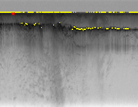

# Boundary-detection

Attempt to find two boundaries(air-ice and ice-rock) on an echogram image. Following assumptions are made 
- The air ice boundary is always above ice rock boundary
- The boundaries span entire width of image.
- Boundary is relatively smooth. Boundary row is similar is similar to the one in previous column.

I tried to solve this problem in three different approaches
 - Simple Bayes
 - Viterbi
 - Human feedback

### Approach 1 - Simple Bayes:
In this I calcualted the emission probabilities by taking edge strength of a coordiante and dividing it by pixel value of that coordinate. The max  emission probability of each column is calculated for air ice boundary. For ice rock boundary, the emission probability table is modified by making above coordinates of air ice to zero. The max emission probability of each column is again taken.

Image 16 Air Ice boundary

Image 16 Ice rock boundary

Image 30 Air Ice boundary

Image 30 Ice rock boundary

### Approach 2 - Viterbi:
In this approach, Viterbi algorithm is used to find boundary. Transition probabily for viterbi is probability of going from  all rows of previous column to current row of current coulumn. 
Initial probability of first coulmn is uniform probability of 1/(row_length).
##### Viterbi table of particular row and column is given as emission_probability of row,column * max(viterbi value of each row,col-1 * transition prob value of each row, col-1)
Air Ice boundary and Ice rock boundary is calculated in similar manner of bayes net except viterbi table is used instead of emission probability table.

Image 09 Air Ice boundary

Image 09 Ice rock boundary

Image 31 Air Ice boundary

Image 31 Ice rock boundary

### Approach 3 - Human Feedback:
Here, Human input coordinates that definitely lie air ice boundary and ice rock boundary are taken. I  modified emission probability table by making emission probability of that coordinates as sum of emission probabilities of that column. All the other values of that coulmn will be zero.

This emission probability table is used calculate viterbi table. Air ice and ice rock boundary is calculated as as in viterbi approach.
Image 16 Air Ice boundary

Image 16 Ice rock boundary

Image 31 Air Ice boundary

Image 31 Ice rock boundary

